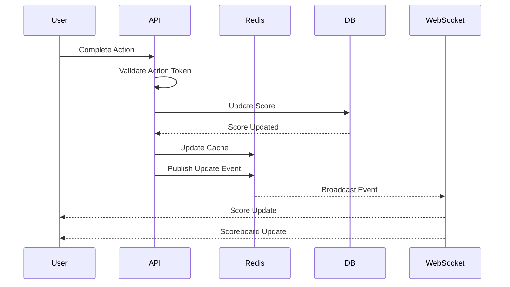

# Real-Time Scoreboard API Service Specification

## Overview

This document specifies a backend API service for managing a real-time scoreboard system that displays the top 10 users' scores with live updates. The system ensures secure score updates and prevents unauthorized manipulation.

## Table of Contents

1. [System Architecture](#system-architecture)
2. [API Endpoints](#api-endpoints)
3. [WebSocket Events](#websocket-events)
4. [Authentication & Security](#authentication--security)
5. [Data Models](#data-models)
6. [Technical Implementation](#technical-implementation)
7. [Scalability Considerations](#scalability-considerations)
8. [Improvement Suggestions](#improvement-suggestions)

## System Architecture

```
┌─────────────────┐         ┌─────────────────┐         ┌─────────────────┐
│                 │         │                 │         │                 │
│   Web Client    │◄────────│   API Gateway   │────────►│    Database     │
│   (Browser)     │         │   (Node.js)     │         │   (PostgreSQL)  │
│                 │         │                 │         │                 │
└────────┬────────┘         └────────┬────────┘         └─────────────────┘
         │                           │
         │ WebSocket                 │
         │                           │
         │                  ┌────────▼────────┐
         │                  │                 │
         └─────────────────►│  Redis Cache    │
                            │  (Pub/Sub)      │
                            │                 │
                            └─────────────────┘
```

## API Endpoints

### 1. User Authentication

#### POST /api/auth/login
Authenticates a user and returns a JWT token.

**Request:**
```json
{
  "username": "string",
  "password": "string"
}
```

**Response:**
```json
{
  "success": true,
  "token": "jwt_token_here",
  "user": {
    "id": "uuid",
    "username": "string",
    "currentScore": 0
  }
}
```

### 2. Score Management

#### POST /api/score/update
Updates the user's score after completing an action.

**Headers:**
```
Authorization: Bearer <jwt_token>
X-Action-Token: <unique_action_token>
```

**Request:**
```json
{
  "actionId": "string",
  "scoreIncrement": 10,
  "timestamp": "2024-01-01T00:00:00Z",
  "actionProof": "encrypted_proof_string"
}
```

**Response:**
```json
{
  "success": true,
  "newScore": 150,
  "rank": 5,
  "scoreboard": [
    {
      "rank": 1,
      "userId": "uuid",
      "username": "player1",
      "score": 500
    }
    // ... top 10 users
  ]
}
```

#### GET /api/scoreboard
Retrieves the current top 10 scoreboard.

**Response:**
```json
{
  "success": true,
  "scoreboard": [
    {
      "rank": 1,
      "userId": "uuid",
      "username": "player1",
      "score": 500,
      "lastUpdated": "2024-01-01T00:00:00Z"
    }
    // ... top 10 users
  ],
  "totalPlayers": 1523,
  "lastUpdated": "2024-01-01T00:00:00Z"
}
```

#### GET /api/score/history
Retrieves the user's score history.

**Headers:**
```
Authorization: Bearer <jwt_token>
```

**Query Parameters:**
- `limit`: Number of records (default: 50)
- `offset`: Pagination offset (default: 0)

**Response:**
```json
{
  "success": true,
  "history": [
    {
      "actionId": "uuid",
      "scoreChange": 10,
      "newScore": 150,
      "timestamp": "2024-01-01T00:00:00Z"
    }
    // ...
  ],
  "total": 245
}
```

## WebSocket Events

### Connection
```javascript
// Client connects with authentication
ws.connect('wss://api.example.com/ws', {
  headers: {
    'Authorization': 'Bearer <jwt_token>'
  }
});
```

### Events

#### Server → Client

**scoreboard:update**
```json
{
  "event": "scoreboard:update",
  "data": {
    "scoreboard": [/* top 10 users */],
    "changes": {
      "entered": ["userId1"],
      "exited": ["userId2"],
      "moved": [
        {
          "userId": "userId3",
          "oldRank": 5,
          "newRank": 3
        }
      ]
    },
    "timestamp": "2024-01-01T00:00:00Z"
  }
}
```

**score:personal:update**
```json
{
  "event": "score:personal:update",
  "data": {
    "userId": "uuid",
    "oldScore": 140,
    "newScore": 150,
    "rank": 5,
    "timestamp": "2024-01-01T00:00:00Z"
  }
}
```

#### Client → Server

**subscribe:scoreboard**
```json
{
  "event": "subscribe:scoreboard"
}
```

## Authentication & Security

### 1. JWT Token Structure
```json
{
  "userId": "uuid",
  "username": "string",
  "iat": 1234567890,
  "exp": 1234567890,
  "permissions": ["score:update", "scoreboard:view"]
}
```

### 2. Action Validation

Each score update requires:

1. **Action Token**: One-time use token generated when action starts
2. **Action Proof**: Encrypted payload containing:
   - Action start timestamp
   - Action completion timestamp
   - Client-side checksum
   - Action-specific data

### 3. Security Measures

1. **Rate Limiting**
   - Max 10 score updates per minute per user
   - Max 100 API calls per minute per IP

2. **Score Validation**
   - Maximum single update: 100 points
   - Minimum time between updates: 10 seconds
   - Anomaly detection for unusual patterns

3. **HMAC Signature**
   - All score updates must include HMAC signature
   - Server validates signature before processing

## Data Models

### User Table
```sql
CREATE TABLE users (
  id UUID PRIMARY KEY DEFAULT gen_random_uuid(),
  username VARCHAR(50) UNIQUE NOT NULL,
  email VARCHAR(255) UNIQUE NOT NULL,
  password_hash VARCHAR(255) NOT NULL,
  current_score INTEGER DEFAULT 0,
  created_at TIMESTAMP DEFAULT CURRENT_TIMESTAMP,
  updated_at TIMESTAMP DEFAULT CURRENT_TIMESTAMP
);

CREATE INDEX idx_users_score ON users(current_score DESC);
```

### Score History Table
```sql
CREATE TABLE score_history (
  id UUID PRIMARY KEY DEFAULT gen_random_uuid(),
  user_id UUID REFERENCES users(id),
  action_id VARCHAR(100) UNIQUE NOT NULL,
  score_change INTEGER NOT NULL,
  new_score INTEGER NOT NULL,
  action_type VARCHAR(50),
  metadata JSONB,
  created_at TIMESTAMP DEFAULT CURRENT_TIMESTAMP
);

CREATE INDEX idx_score_history_user ON score_history(user_id);
CREATE INDEX idx_score_history_created ON score_history(created_at);
```

### Action Tokens Table
```sql
CREATE TABLE action_tokens (
  token VARCHAR(255) PRIMARY KEY,
  user_id UUID REFERENCES users(id),
  action_type VARCHAR(50) NOT NULL,
  expires_at TIMESTAMP NOT NULL,
  used BOOLEAN DEFAULT FALSE,
  created_at TIMESTAMP DEFAULT CURRENT_TIMESTAMP
);

CREATE INDEX idx_action_tokens_user ON action_tokens(user_id);
CREATE INDEX idx_action_tokens_expires ON action_tokens(expires_at);
```

## Technical Implementation

### 1. Technology Stack
- **Backend Framework**: Node.js with Express/Fastify
- **WebSocket**: Socket.io or ws library
- **Database**: PostgreSQL for persistent storage
- **Cache**: Redis for scoreboard cache and pub/sub
- **Authentication**: JWT with refresh tokens
- **API Documentation**: OpenAPI 3.0 specification

### 2. Caching Strategy

```javascript
// Redis cache structure
{
  "scoreboard:top10": [
    { "userId": "uuid1", "username": "player1", "score": 500 },
    // ... top 10
  ],
  "user:score:{userId}": 150,
  "user:rank:{userId}": 5
}

// Cache TTL
- Scoreboard: 5 seconds
- User score: 30 seconds
- User rank: 30 seconds
```

### 3. Real-time Update Flow



## Scalability Considerations

### 1. Horizontal Scaling
- Stateless API servers behind load balancer
- Redis Cluster for distributed caching
- PostgreSQL with read replicas

### 2. Performance Optimizations
- Database sharding by user ID range
- Materialized views for scoreboard queries
- Connection pooling for database connections
- WebSocket sticky sessions with Redis adapter

### 3. Monitoring
- Prometheus metrics for API performance
- ELK stack for centralized logging
- Real-time alerting for anomalies

## Improvement Suggestions

### 1. Enhanced Security
- **Two-Factor Authentication**: Add 2FA for high-value accounts
- **Blockchain Integration**: Store score hashes on blockchain for immutability
- **Machine Learning**: Implement ML-based fraud detection
- **Client Fingerprinting**: Track device fingerprints to detect suspicious activity

### 2. Features
- **Leaderboard Seasons**: Weekly/Monthly leaderboards with rewards
- **Score Decay**: Implement score decay to keep competition active
- **Achievement System**: Badges and milestones for user engagement
- **Social Features**: Friends list, team scores, challenges

### 3. Technical Improvements
- **GraphQL API**: Offer GraphQL endpoint for flexible queries
- **gRPC**: Internal service communication via gRPC
- **Event Sourcing**: Store all score changes as events
- **CQRS Pattern**: Separate read/write models for better performance

### 4. Analytics
- **Real-time Analytics**: Dashboard for monitoring user activity
- **A/B Testing**: Framework for testing scoring algorithms
- **User Behavior Tracking**: Understand user patterns
- **Performance Metrics**: Track API response times, WebSocket latency

### 5. Disaster Recovery
- **Backup Strategy**: Automated backups with point-in-time recovery
- **Failover System**: Automatic failover to secondary region
- **Data Validation**: Regular integrity checks on scores
- **Audit Trail**: Complete audit log of all score changes

## API Rate Limits

| Endpoint | Rate Limit | Window |
|----------|------------|--------|
| POST /api/auth/login | 5 requests | 15 minutes |
| POST /api/score/update | 10 requests | 1 minute |
| GET /api/scoreboard | 60 requests | 1 minute |
| WebSocket Connection | 3 connections | Per user |

## Error Codes

| Code | Description | Action |
|------|-------------|--------|
| 401 | Unauthorized | Re-authenticate |
| 403 | Forbidden - Invalid action token | Request new action token |
| 429 | Rate limit exceeded | Wait and retry |
| 409 | Duplicate action | Action already processed |
| 422 | Invalid score increment | Check validation rules |

## Development Guidelines

1. **Code Style**: Follow ESLint configuration
2. **Testing**: Minimum 80% code coverage
3. **Documentation**: JSDoc for all public methods
4. **Git Flow**: Feature branches with PR reviews
5. **CI/CD**: Automated testing and deployment

## Deployment Checklist

- [ ] Environment variables configured
- [ ] SSL certificates installed
- [ ] Database migrations completed
- [ ] Redis cluster configured
- [ ] Monitoring alerts set up
- [ ] Load testing completed
- [ ] Security audit passed
- [ ] Documentation updated
- [ ] Rollback plan prepared