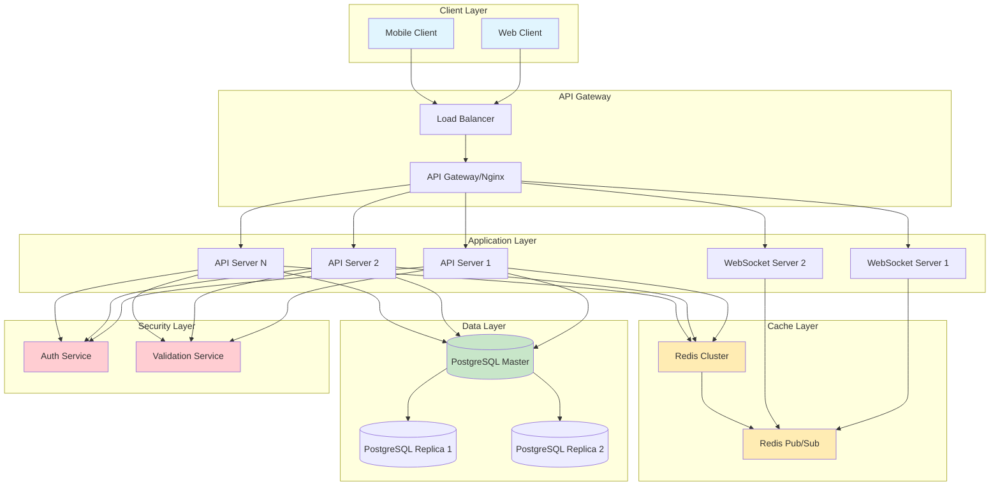
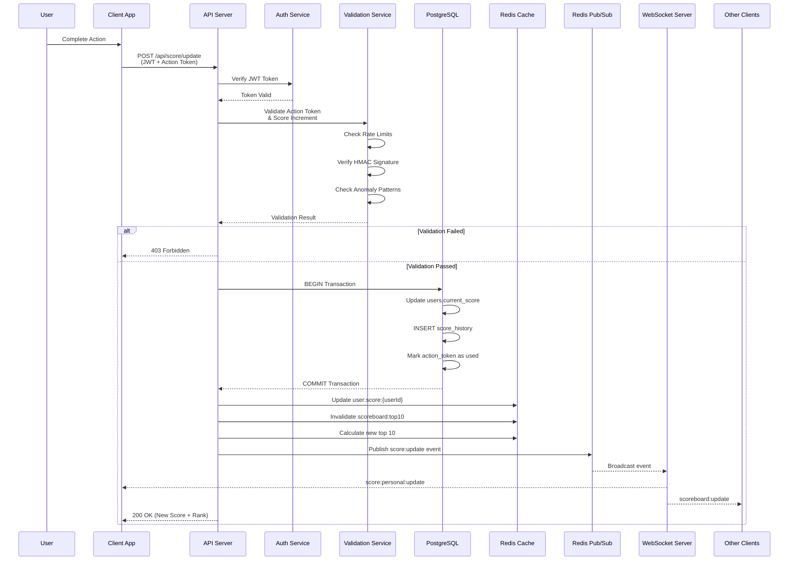
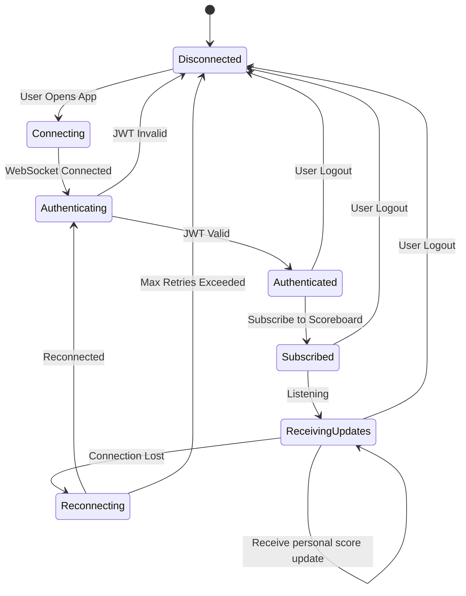
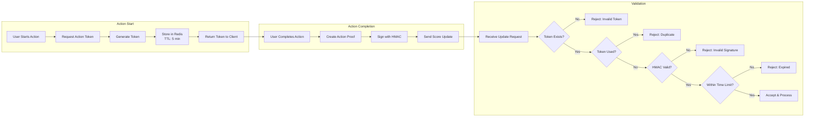
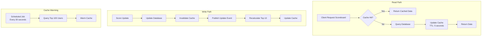
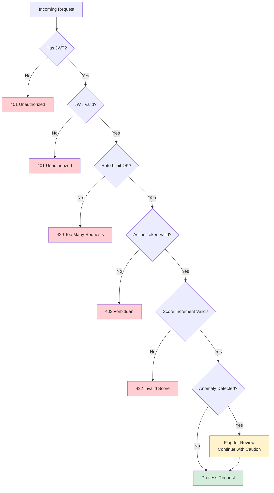
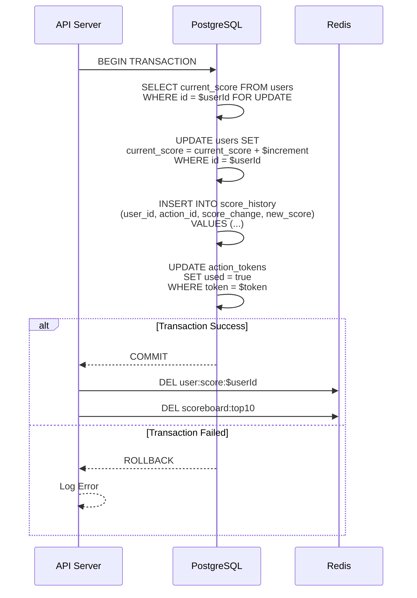
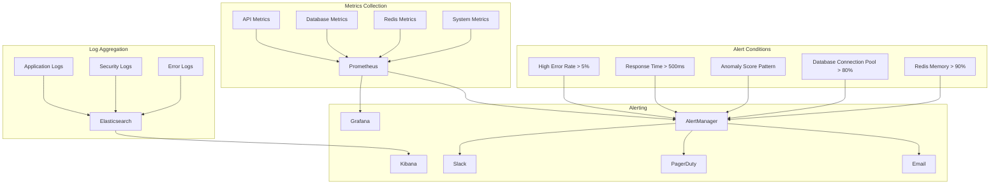

# Scoreboard System Flow Diagrams

## 1. Overall System Architecture

## 2. Score Update Flow

## 3. Real-time WebSocket Connection Flow

## 4. Action Token Generation and Validation Flow

## 5. Caching Strategy Flow

## 6. Security Check Flow

## 7. Database Transaction Flow for Score Update

## 8. Monitoring and Alerting Flow

